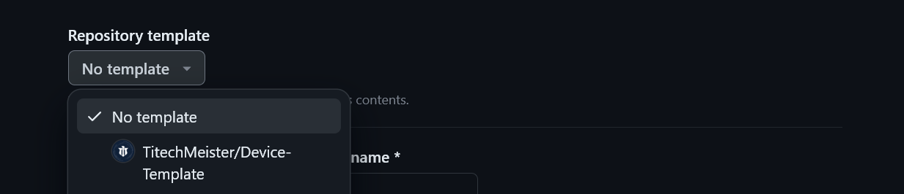

# Device-Template

> A template for building applications for Twelite

This project is developed and maintained by the Meister

## Dependencies

To build embedded programs using this template you'll need:

- KiCad Version: 7.0.1, or a newer version.

- Git client

- Twelite Stage

- Visual Studio Code with C/C++ extention

- Github CLI (optional)

## Using this template

1. Repositoryを作る際にRepository Templateとして`TitechMeister/Device-Template`を選択してください。


2. `setup.sh`を実行してください。

3. プログラムを書くときは、`src/twelite`を**フォルダとして**開いてください。フォルダとして開くことにより、includePathなどを自動で設定してくれます。

## Using this template with GitHub CLI

```sh
gh repo create ${repo name} --private --template https://github.com/TitechMeister/Device-Template -c
cd ${repo name}
sh ./setup.sh
```

注. 自分のアカウントにRepositoryが作られます。